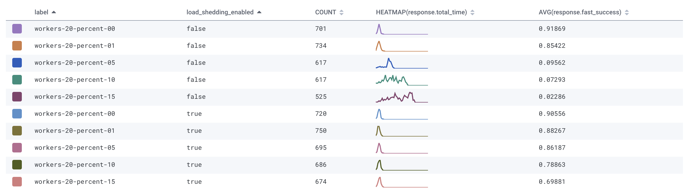

# loadshedding-experiment-ruby

A sample Ruby/Rack application to test/experiment with the impact of
loadshedding on request queue time.

The application runs a `puma` webserver with 20 threads, every request will
do at least 100ms of work, with a configuration percentage chance of doing 1000ms
of work in order to simulate some abnormal slow downstream service.

The percentage chance is dynamically configurable based on the `percent` query
parameter. An optional `label` query parameter can also be passed in order to
group experiments together.

Every request sends a event to Honeycomb with the following fields:

- `label` - the label as passed in the query parameter (defaults to `unknown`)
- `load_shedding_enabled` - Whether the `LOAD_SHED` environment variable is set to `1`, enabling load shedding middleware.
- `response.queue_time` - how long (in ms) the request was waiting (queued) before being processed by puma.
- `response.serve_time` - how long (in ms) the request took to process by puma.
- `response.total_time` - how long (in ms) we took in total to send a response.
- `response.status` - the HTTP response status (either 200 or 503).

By default this application will drop _any_ request that has queued for longer
than 10s. When `LOAD_SHED=1` is set, the application will check requests for a
`X-Client-Timeout-Ms` header, and drop any requests that have queued longer
than the clients declared timeout.

Load shedding in this manner is expected to make applications perform better
under extreme load and try and mitigate cascading failures between internal
services by bounding total latency and helping the server preserve resources
where possible.

Load shedding in this manner has _no_ adverse effect on client requests, as the
client has already treated the request as timed out. It allows the server to
recover resource that would have been wasted, prioritising requests that are
still _meaningful_ to serve. In an environment where clients automatically
retry requests, this means that retries are more likely to succeed, as queue
depth is controlled.

### Results

The results show that with load shedding enabled, the queue remains controlled
and we are able to serve 10x more requests that result in a 2XX response _within_
the client timeout threshold.

Load shedding is an easy addition to your application middleware stack that can
mean the difference between service degradation and service unavailability.

### Replicating results

The `scripts/load` script runs a series of 'trials' using `rakyll/hey` to
create traffic. It expects an argument to be the name of a Heroku application
to run the test against. It will automatically set and unset the `LOAD_SHED`
environment variable to observe the behaviour of the application with and
without load shedding.

It expects a single argument, the name of the heroku application e.g.

`scripts/load load-shedding-test-application`

`HONEYCOMB_WRITE_KEY` will need to be set in order to record metrics via
honeycomb.io -- a free account can be created which has more than enough quota
for this purpose.

---

There is some more information about testing this in production in a [blog post](https://medium.com/carwow-product-engineering/shadow-requesting-for-great-good-92cde331363a).
